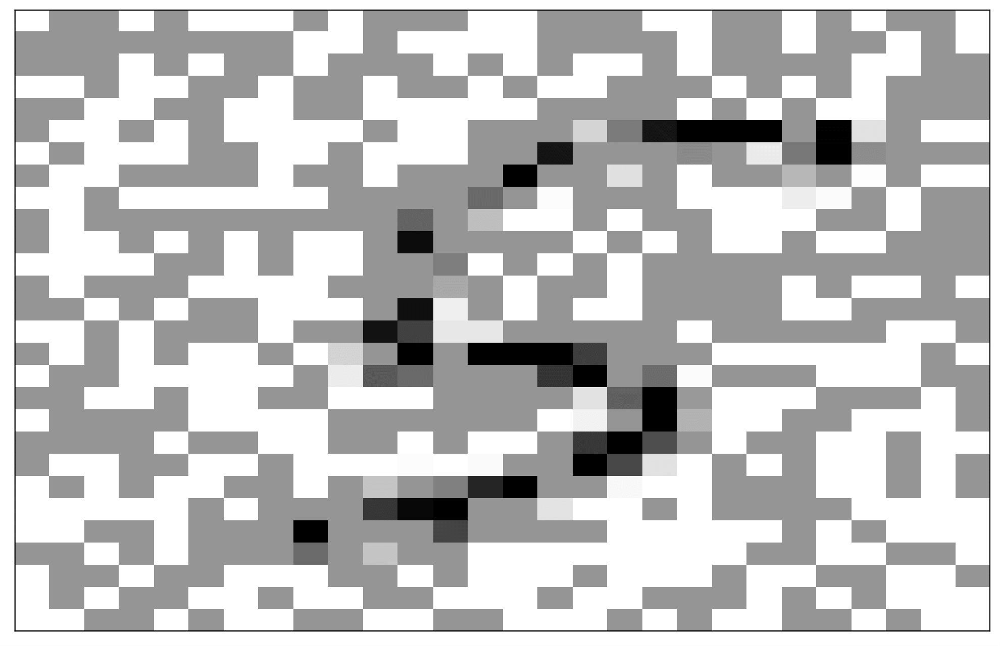
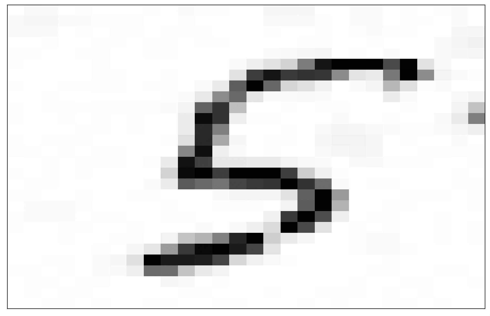

# IMAGE INPAINTING WITH FLUID DYNAMICS

Image inpainting aims to remove damage from an image. There are various techniques for image inpainting, and here we focus on solving a fluid-type PDE denoted as the Cahn-Hilliard equation.

The three take-home messages from this notebook are that:

1. Image inpainting can be solved with efficient and parallelizable finite-volume schemes
2. The classification accuracy of neural networks is affected by the presence of damage 
3. The application of image inpainting in damaged images improves their classification accuracy

&nbsp;

#### Damaged image:

#### Restored image:

